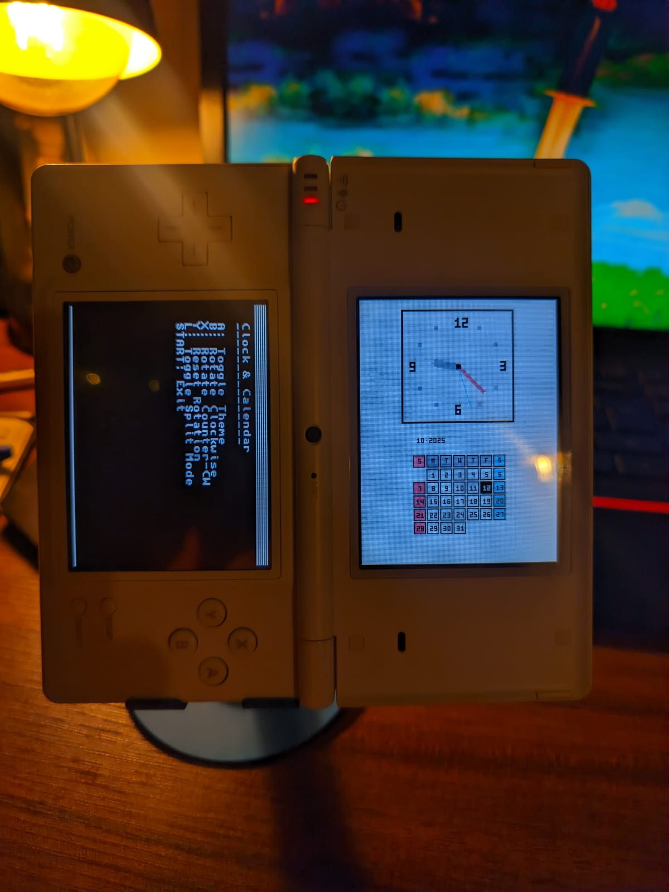

# Clock & Calendar DS Homebrew

A dual-screen Nintendo DS Widget experience built with the devkitARM toolchain and libnds. The top screen renders an analog clock, calendar, battery and a sound visualizer. that can be rotated and toggled between light and dark themes. You can also have the calendar take over the bottom screen for a vertical view. (it currently does not work. lol.)

This is good for you to prop up your DS and glance at the time and date. your co-workers will be jealous of your sweet setup. 

## The Vision

You kinda have to see the vision. My vision is to have a clock, a calendar. maybe a pomodoro timer, a to-do list, a battery indicator and some small glanceable things. Kinda like the ds-lite home screen, i took inspiration from that.

im working on this "widget" idea so its easier to build more widgets in the future. a music one, maybe internet connectivity for weather. some dumb stuff like gifs. who knows.

