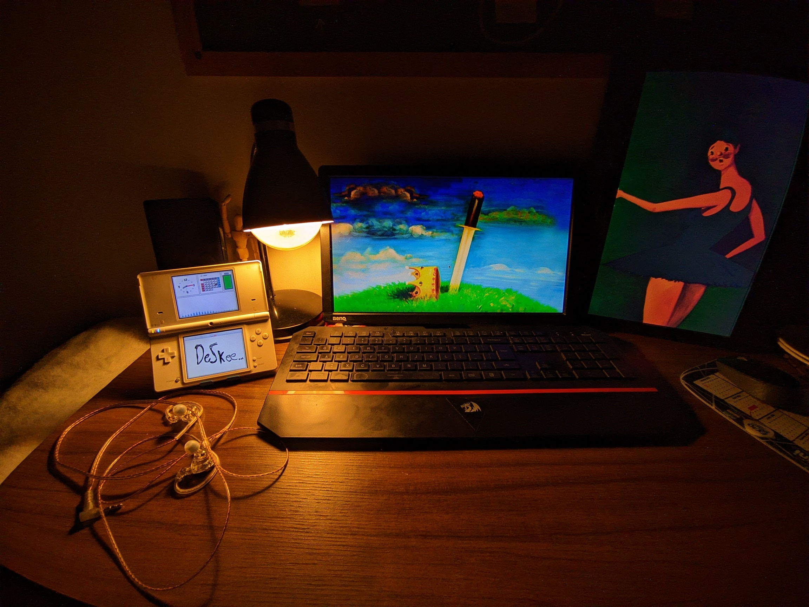

# DeSkee - A Nintendo DSi homebrew widget

> Put it on your desk.

A dual-screen Nintendo DS(i) Widget experience built with the devkitARM toolchain and libnds. Turn your DS into a glanceable desk companion with clock, calendar, audio visualizer, and more. They can be rotated and toggled between light and dark themes. You can also have the calendar take over the bottom screen for a vertical view. (it currently does not work. lol.)

This is good for you to prop up your DS and glance at the time and date. Your co-workers will be jealous of your sweet setup.


## The Vision

You kinda have to see the vision. My vision is to have a clock, a calendar. maybe a pomodoro timer, a to-do list, a battery indicator and some small glanceable things. Kinda like the ds-lite home screen, i took inspiration from that.

im working on this "widget" idea so its easier to build more widgets in the future. a music one, maybe internet connectivity for weather. some dumb stuff like gifs. who knows.




## Building

To build DeSkee, you'll need to have the devkitARM toolchain and libnds installed. if you haven't set up devkitARM yet, follow the instructions on the [devkitPro website](https://devkitpro.org/wiki/Getting_Started/devkitARM).

i suggest using the flake.nix that i did for nix users. it has everything you need to build this project.

```bash
nix develop
make
```

This will compile the source code and generate a `DeSkee.nds` file in the project directory.
You can then transfer the `DeSkee.nds` file to your Nintendo DSi using an SD card. I did not test this on a DS Lite or in an R4, but it should work there too.

## Usage

Once you have transferred the `DeSkee.nds` file to your Nintendo DSi, insert the SD card into your device and launch the homebrew application using a compatible homebrew launcher.

Enjoy having a desk companion on your Nintendo DSi!

## Contributing

Contributions are welcome! If you have ideas for new widgets or improvements to existing ones, feel free to open an issue or submit a pull request.

## License

This project is licensed under the GNU General Public License v3.0 (GPL‑3.0). See the [LICENSE](LICENSE) file for the full text or view it online: [GNU.org license](https://www.gnu.org/licenses/gpl-3.0.en.html)

SPDX-License-Identifier: GPL-3.0-or-later

## Acknowledgments

- Thanks to the [devkitPro](https://github.com/devkitPro) community for their excellent tools and libraries.
- Thanks to the [TWiLightMenu++](https://github.com/DS-Homebrew/TWiLightMenu) team, I used the "hour" sound from their project.
